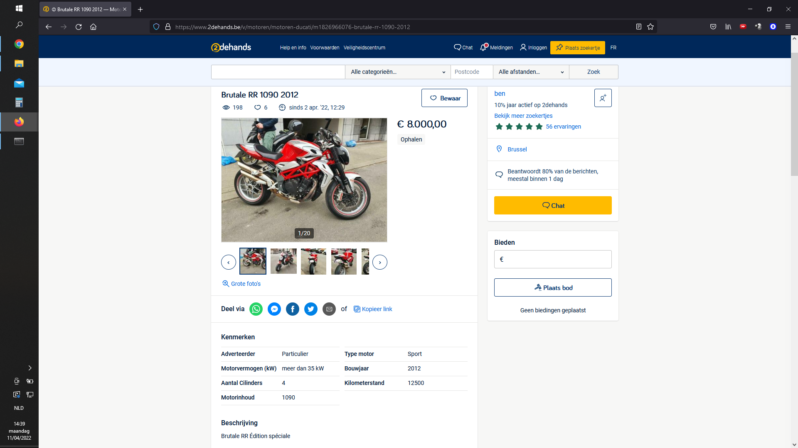
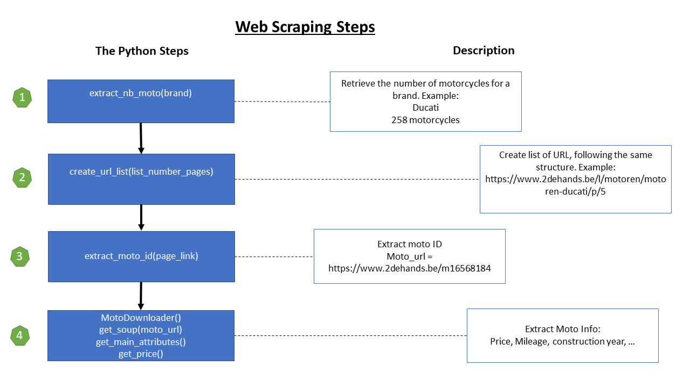
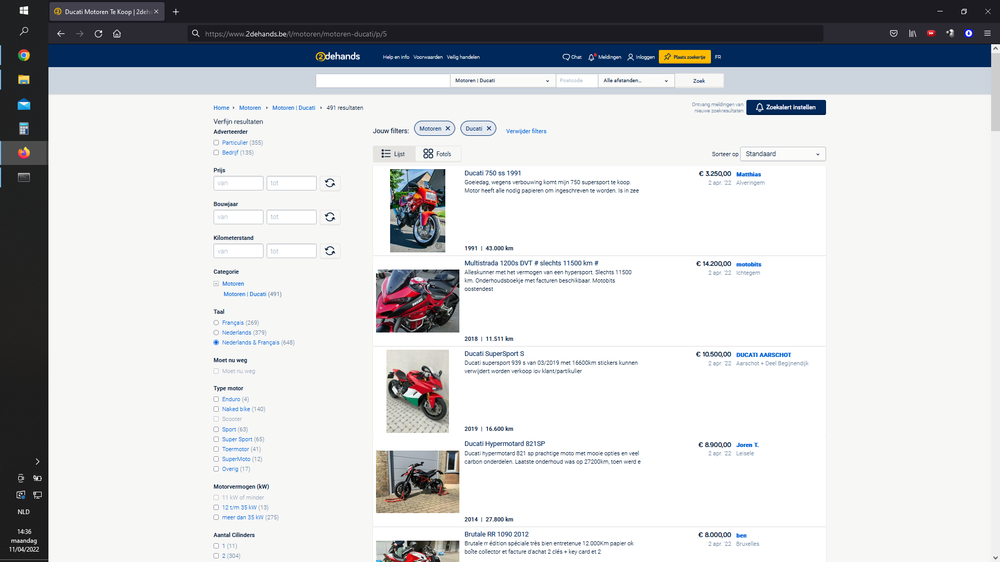

<h1> Project Second-hand Motorcycles </h1>

  
In this project, we collected second-hand motorcycle data from https://www.2dehands.be/ and created a performance metric that the user can utilize to find an excellent second-hand motorcycle deal.
https://www.2dehands.be/ is a marketplace where private and professional individuals can post an item for sale.
From clothing to houses, many different categories are available on this website.
(A requirements file is available for the ones who want to reproduce my codes in Python) 

 The structure of the project follows a standard data science workflow:
<li> web scraping </li>
<li> merge and clean data </li>
<li> descriptive part </li>
<li> feature engineering </li>
<li> final product </li>

We want to extract key attributes of a given motorcycle such as price, mileage, construction year, etc.
Each item on https://www.2dehands.be has a unique ID in the following format: m1745026148.
To access the item’s page, in our case, the motorcycle, we would need to parse https://www.2dehands.be/m1745026148 in a browser.
Below is an example of what we would retrieve in our browser. 

<h2> How did the webscraping happen?</h2>
We need to find all the motorcycle IDs before we can scrape them from the internet. In other words,
there are a few steps before we can retrieve all the characteristics of motorcycles. 
The schema below shows the various steps taken to extract the necessary information.

<h3> General Schema </h3>

<h3> Additional information about schema </h3>

 As previously stated, before we can retrieve all the data on motorcycles, we need to have their unique ID.
For each brand, it is possible to retrieve all the motorcycle’s IDs easily from such a page:
https://www.2dehands.be/l/motoren/motoren-bmw/p/3/#Language:all-languages
Each page has 30 motos, so if we have 375 pages * 30 motos = 11 250 moto IDs. 
Some brands have more pages than others, as you can see from the list 'amount_pages'.
For example, we have much more YAMAHA than Ducati.
The HTML structure is the same for each brand, so we easily loop over it. 
Below is an example of what the page looks like. 

Once we have all the moto IDs, then it is possible to retrieve their complete information from the URL.
We use the moto id to scrape each motorcycle individually. So around 11 250 pages will be scrapped.

<h2> Further steps </h2>

<h3> Data cleaning, preprocessing </h3>

<h3> Feature engineering </h3>

<h3> Data visualization </h3>
